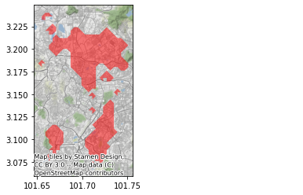

# project-suka-suka

Husein pet projects in here!

## List of projects

1. [mysejahtera-density](mysejahtera-density).

Generate resolution points using meshgrid and request each points to MySejahtera Hotspot API to get active cases in 1KM radius.

2. [mysejahtera-hotspot](mysejahtera-hotspot).

Use [mysejahtera-density](mysejahtera-density) to generate hotspot polygons.

3. [mysejahtera-simulation](mysejahtera-simulation).

Use [mysejahtera-density](mysejahtera-density) to generate hotspot polygons and simple simulation.