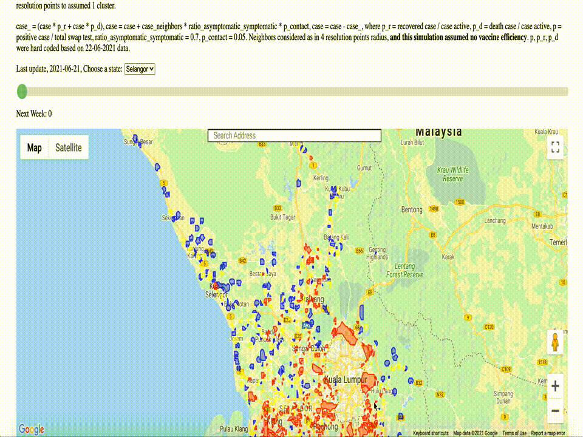

# MySejahtera Simulation

Generate polygons and simple simulation using MySejahtera Density data. https://huseinhouse.com/mysejahtera-simulation/



## how-to

1. Run [selangor-simulation-vaccines.ipynb](selangor-simulation-vaccines.ipynb).

```python
# p = positive case / total swap test, taken from https://ourworldindata.org/coronavirus-data?country=~MYS
p = 5600.29 / 83527
# p_r = recovered case / case active, taken from https://twitter.com/KKMPutrajaya
p_r = 5557 / 62027
# p_d = death case / case active
p_d = 77 / 62027

# Covid-19: 70% of cases in Malaysia were asymptomatic, says Health DG, https://www.thestar.com.my/news/nation/2020/07/08/covid-19-70-of-cases-in-malaysia-were-asymptomatic-says-health-dg
ratio_asymptomatic_symptomatic = 0.7
# probability to contact, pretty naive assumption
p_contact = 0.05
# 1 unit resolution point distance is 0.005 based on euclidean, 0.02 = 4 units resolution point distance
max_distance = 0.02

vaccine_effiencies = [0.25, 0.5, 0.75, 0.90]

# calculate resistant
case_ = (case * (p_r / (1 - effiency) + case * (p_d * (1 - effiency))
# calculate infected based on neighbor
case = case + case_neighbors * ratio_asymptomatic_symptomatic * p_contact * (1 - effiency)
case = case - case_
```

## Why

1. Simulation if 0%, 25%, 50%, 75%, 90% vaccine efficiency.
